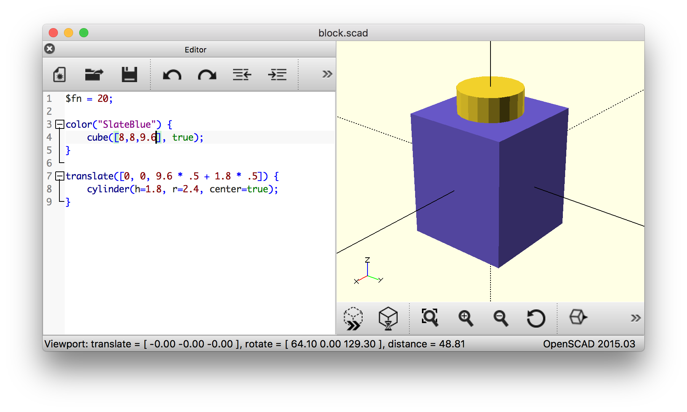
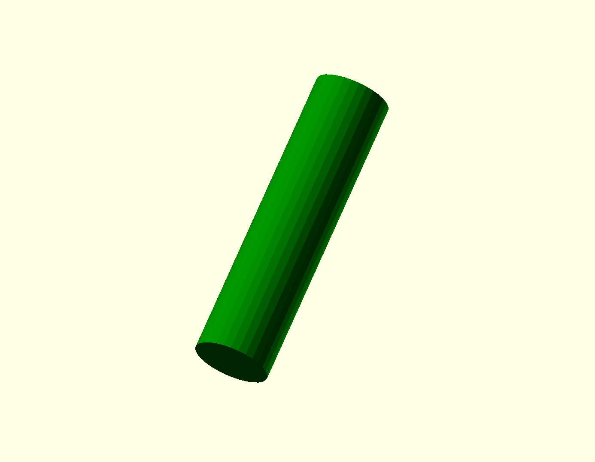
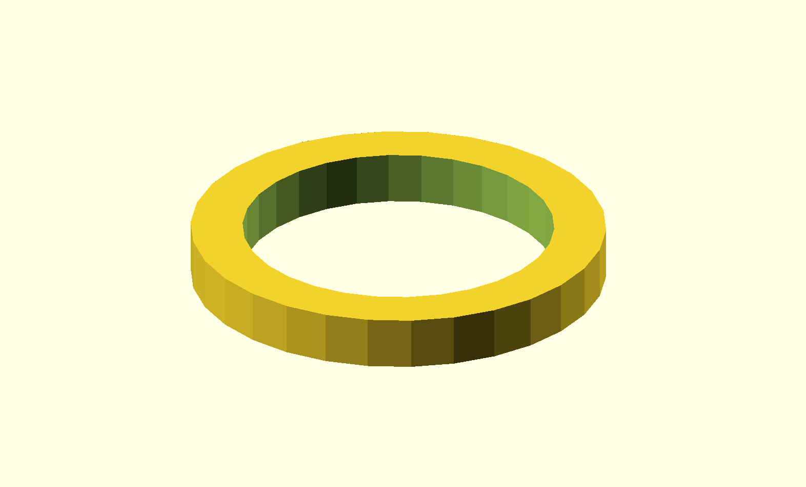
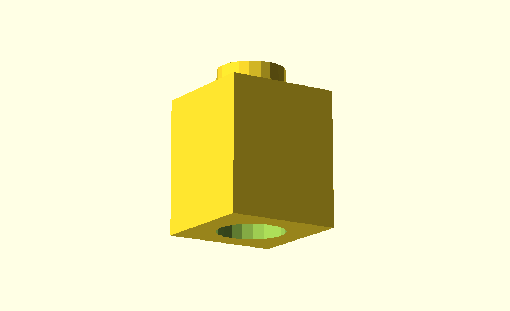
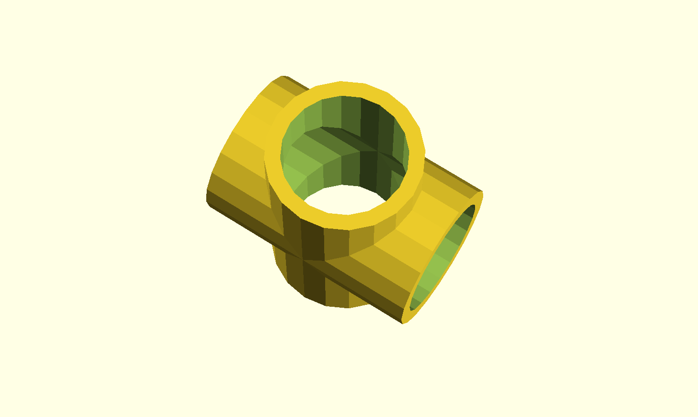
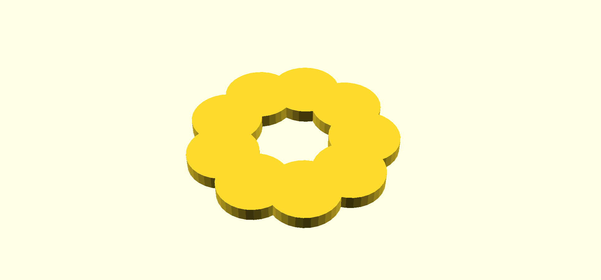

## 3D Forms

> It is not hard to understand modern art. If it hangs on a wall it's a painting, and if you can walk around it it's a sculpture.
>
> Tom Stoppard, author of [Rosencrantz & Guildenstern are Dead](<https://en.wikipedia.org/wiki/Rosencrantz_%26_Guildenstern_Are_Dead_(film)>){attrib}

Most of the favorite subjects of representational art—human figures, landscapes, still lifes—are three dimensional forms. Paintings and drawings represent these forms by projecting them into two dimensions. This is a destructive process in which part of the form is lost. You cannot walk around a painting to see its subject from the other side. Where a painting strives to convey a sense of scale, of volume, of substance, and of presence, a sculpture cannot escape them.

On screen, 3D graphics exist in between painting and sculpture. You can rotate computer generated 3D shapes, but you are still seeing a 2D projection. 3D Printing brings these shapes into the physical world. Getting "real" results from procedural generation can be very gratifying, providing physical evidence of your efforts. While not physical, VR is also a compelling medium for computational form. I especially enjoy combining the rapid iteration enabled by working procedurally with the sense of presence and scale afforded by virtual reality. It is an intensely creative experience to procedurally generate a tree and immediately stand in its shadow looking up at the sky through its branches.





## OpenSCAD

[OpenSCAD](http://www.openscad.org/about.html) is a language for specifying procedural 3D forms using [constructive solid geometry](https://en.wikipedia.org/wiki/Constructive_solid_geometry). CSG is a modeling technique in which complex shapes are created by combining simple shapes using boolean operations like union, difference, and intersection. It is well-suited to designing mechanical parts for manufacturing, but not well-suited for organic shapes or characters.



<div class="link-box">

[**OpenSCAD.org** Library Website](http://www.openscad.org/)
Main site for OpenSCAD. IDE Download, Documentation, Examples.

[**OpenSCAD CheatSheet** Official Documentation](http://www.openscad.org/cheatsheet/index.html)
A quick index of OpenSCAD's syntax and library.

[**OpenSCADManual** Official Documentation](https://en.wikibooks.org/wiki/OpenSCAD_User_Manual)
The specifics of the OpenSCAD IDE and language.

[**OpenSCAD.net** Library Alternative](http://openscad.net/)
A web-based OpenSCAD editor and renderer. Does not implement every feature of OpenSCAD.

</div>

<div class="activity">

## Hello, OpenSCAD!

Download OpenSCAD, set it up, and try to recreate the images below. Tip: Use code to rotate the bar.




</div>

### OpenSCAD is not like C

At first glance OpenSCAD syntax looks similar to C or JavaScript, with braces, brackets, and semicolons appearing about where you would expect. But as you read the code you see some surprising differences.

Look at the example below, which creates a ring by subtracting one cylinder from another.

```javascript
difference() {
    cylinder (h=1, r=4, center = true);
    cylinder (h=1, r=3, center = true);
}
```

In the example, `difference()` looks somewhat like a function definition and it works somewhat like a function call and. It isn't really either of things. In the vocabulary of OpenSCAD `difference()` is an **operator** and `cylinder(...);` is an **action**. Operators act on actions or **groups** of actions in braces.

These differences reflect the fundamentally different approach to programming in OpenSCAD compared to C.

### Functional vs. Procedural

<div class="sidebar link-box">

[**4 Paradigms in 40 Minutes** Video](https://www.youtube.com/watch?v=cgVVZMfLjEI)

</div>

The [OpenSCAD Manual](https://en.wikibooks.org/wiki/OpenSCAD_User_Manual/The_OpenSCAD_Language) describes OpenSCAD as a [functional](https://en.wikipedia.org/wiki/Functional_programming) programming language. One could also more generally refer to OpenSCAD as a [declarative](https://en.wikipedia.org/wiki/Declarative_programming) language. In contrast to JavaScript, C, and Processing, it is not an [imperative](https://en.wikipedia.org/wiki/Imperative_programming) or [procedural](https://en.wikipedia.org/wiki/Procedural_programming) language.

Classifying programming languages by [paradigm](https://en.wikipedia.org/wiki/Programming_paradigm) is tricky in practice. The boundaries of paradigms are not always clear. Different paradigms have different primary concerns and may be orthogonal to each other, and many languages support multiple paradigms.

| paradigm                    | description                                                                                                        |
| --------------------------- | ------------------------------------------------------------------------------------------------------------------ |
| imperative                  | focuses on the steps needed to achieve a goal; ordered commands, mutable program state                             |
| ↳&nbsp;procedural           | an imperative approach that primarily organizes commands using procedures                                          |
| ↳&nbsp;object&nbsp;oriented | an imperative approach that groups related data and procedures using objects                                       |
| declarative                 | focuses on what you want to achieve rather than the steps to achieve it; unordered                                 |
| ↳&nbsp;functional           | a declarative approach that organizes logic using pure functions with immutable states and no side effects         |
| ↳&nbsp;logic                | a declarative approach in which a program is a collection of logical declarations from which facts can be inferred |

### Immutable vs. Mutable Data

The most noticeable effect of OpenSCAD being functional is that data in OpenSCAD is immutable: the value of every variable is constant. In fact, variables are not even assigned values at runtime. A variable's value is determined and assigned at compile time, before the script is run. Since variables are constant, you should only assign a variable a value one time. If you do assign to a variable more than once, the variable's value will be the _last_ assigned value, which is pretty confusing.

```
a = 1;
echo(a); // -> 2
a = 2;
echo(a); // -> 2
```

This takes some getting used to. It helps to keep in mind that variables are constant and given their value before the script is run. The OpenSCAD manual goes into more detail about how [variables](https://en.wikibooks.org/wiki/OpenSCAD_User_Manual/The_OpenSCAD_Language#Variables) behave.

### Prefix vs. Infix Notation

OpenSCAD's boolean and transformation operators appear in code _before_ their operands. This is called prefix notation. OpenSCAD's mathematic operators appear _between_ their operands. This is called infix notation.

Infix notation probably looks familiar. Its how arethmatic is notated, and is used in the most popular programming languages.

Javascript expression with infix notation

```javascript
2 * 3 -> 6
2 * 3 * 4 -> 24
2 * (3 + 4) -> 14
```

Prefix notation probably doesn't look familiar, though it is used in some important programming languages.

Lisp expressions with prefix notation

```lisp
(* 2 3) -> 6
(* 2 3 4) -> 24
(* 2 (+ 3 4)) -> 14
```

While the example above looks unusual if you are used to C or JavaScript, prefix notation isn't really that unusual. Compare infix notation to calling a function in JavaScript. The name of the function comes first, followed by the parameters.

```javascript
multiply(2, 3) -> 6
multiply(2, 3, 4) -> 24
multiply(2, add(3, 4)) -> 14
```

You can think of OpenSCAD's boolean and transform operations as prefix operators or function calls. Unlike JavaScript and C, the contents of `{}` are operands or parameters rather than statements.

```javascript
union() {
    cylinder (h=4, r=1, center = true);
    rotate ([90,0,0]) cylinder (h=4, r=1, center=true);
}
```

### Named vs. Positional Parameters

OpenSCAD supports both positional and named parameters.

OpenSCAD with named parameters

```
cylinder(h = 4, r = 1, center = true);
```

OpenSCAD with positional parameters

```
cylinder(4, 1, 1, true);
```

Javascript emulating named params with an object literal

```javascript
cylinder({ h: 4, r: 1, center: true });

function cylinder(options) {
  let h = options.h;
  let r = options.r;
  let center = options.center;
}
```

## OpenJSCAD

OpenSCAD's functional model has its advantages, but imperative languages also have advantages. For one, imperative languages are more familiar to most programmers. To explore constructive solid geometry modeling in an imperative style, you may want to use one OpenJSCAD.

<div class="link-box">

[**OpenJSCAD** Library Website](http://joostn.github.io/OpenJsCad/)
Web-based solid modeling in JavaScript. OpenSCAD but in JS.

[**OpenJSCAD.org** Web-Based IDE](https://openjscad.org/)
A web-based IDE built on OpenJSCAD. Check out the [OpenJSCAD.org repo](https://github.com/jscad/OpenJSCAD.org).

[**OpenJSCAD.org User and Programming Guide** Official Documentation](https://en.wikibooks.org/wiki/OpenJSCAD_User_Guide)
Manual for OpenJSCAD syntax and library.

</div>

## Study Examples

These examples will build up to a simplified parametric Lego brick, introducing many features of OpenSCAD along the way. To get started we'll need the [dimensions of a Lego brick](https://www.cailliau.org/en/Alphabetical/L/Lego/Dimensions/General%20Considerations/).

### Generating Primitives

```
$fn = 20;
% cube([8,8,9.6], true);
cylinder(h=1.8, r=2.4, center=true);
```

{wide}

#### $fn, $fa, \$fs

`$fn`, `$fa`, and `$fs` are special variables that control how many edges are used for drawing arcs and circles. In the example above `$fn` is set to `20` telling OpenSCAD to make the cylinder with 20 sides. If `$fn` is `0` OpenSCAD will calculate the number of sides using a minimum angle `$fa` between edges and a minimum edge length `$fs`.

#### %, #, \*, !

The `%`, `#`, `*`, and `!` [modifier characters](https://en.wikibooks.org/wiki/OpenSCAD_User_Manual/Modifier_Characters) can alter how parts of your drawing are rendered. These can be used to ghost, highlight, disable, or isolate a shape or subtree respectively.

In the example above the cube is ghosted or backgrounded. It is shown in transparent gray but isn't a real part of the rendered geometry.

#### echo

OpenSCAD has an [echo()](https://en.wikibooks.org/wiki/OpenSCAD_User_Manual/Other_Language_Features#Echo_Statements) statement for tracing out debugging info.

### Transformations

```
$fn = 20;

color("SlateBlue") {
    cube([8,8,9.6], true);
}

translate([0, 0, 9.6 * .5 + 1.8 * .5]) {
    cylinder(h=1.8, r=2.4, center=true);
}
```

{wide}

`Translate()` moves the shapes passed to it. Here translate moves the cylinder up. Notice that the braces are used to group parameters to translate. You can also scale, resize, rotate, and mirror shapes

The example also demonstrates using `color` to change the color used to render the cube. Use color to make it easier to understand your model.

### Boolean Operations

```
$fn = 20;

difference() {
    union() {
        cube([8,8,9.6], true);
        translate([0,0,9.6 * .5 + 1.8 * .5]) {
            cylinder(h=1.8, r=2.4, center=true);
        }
    }
    translate([0,0, -9.6 * .5 + 1.8 * .5]) {
        cylinder(h=1.8, r=2.4, center=true);
    }
}
```

{wide}

This example uses `difference()` and `union()` to combine shapes. A cylinder and cube are combined with `union()` and a recess is cut out of the resulting shape using `difference()`. OpenSCAD also has an `intersect()` operator.

OpenSCAD may not preview this shape very cleanly. Render the shape with `Main Menu > Design > Render` to get a clear view of the rendered geometry.

### Variables + Modules

```
$fn = 20;
brick_width = 8;
brick_height = 9.6;
knob_radius = 2.4;
knob_height = 1.8;

module unit_brick () {
    difference() {
        union() {
            cube([brick_width, brick_width, brick_height], true);
            translate([0, 0, (brick_height + knob_height) * .5]) {
                cylinder(h=knob_height, r=knob_radius, center=true);
            }
        }
        translate([0,0, (-brick_height + knob_height) * .5]) {
            cylinder(h=knob_height, r=knob_radius, center=true);
        }
    }
}

unit_brick();
```

This example produces the same shape as the example above, but uses variables and a module definition to make the code easier to read.

### For Loops

```
$fn = 20;
brick_width = 8;
brick_height = 9.6;
knob_radius = 2.4;
knob_height = 1.8;
rows = 2;
columns = 8;


module unit_brick () {
    difference() {
        union() {
            cube([brick_width, brick_width, brick_height], true);
            translate([0, 0, (brick_height + knob_height) * .5]) {
                cylinder(h=knob_height, r=knob_radius, center=true);
            }
        }
        translate([0,0, (-brick_height + knob_height) * .5]) {
            cylinder(h=knob_height, r=knob_radius, center=true);
        }
    }
}


for (x = [0:columns-1], y = [0:rows-1]) {
    translate([x * brick_width, y * brick_width, 0]) {
        unit_brick();
    }
}

```

{wide}

This example uses `for` to create several instances of our basic shape. OpenSCAD's `for()` looks a lot like the imperative flow control structure, but [works differently](https://en.wikibooks.org/wiki/OpenSCAD_User_Manual/Conditional_and_Iterator_Functions#For_Loop) because OpenSCAD is functional.

The `for` loop creates a union of multiple instances of the following group. Each instance is constructed in its own scope and no data can flow between scopes.

The OpenSCAD `for` syntax allows "iterating" over multiple variables at once. This example will create a unit brick for every combination of x and y. In JavaScript you would use a nested pair of loops to achieve a similar effect.

<div class="activity">

## Coding Challenges

Try creating OpenSCAD scripts for each of these shapes.





Build this shape so that you can parametrically control the number of disks that make up the ring.

</div>

## Parametric OpenSCAD

<div class="sidebar link-box">

[**Parametric Pulley** Thingiverse](https://www.thingiverse.com/thing:16627)

[**Parametric Nuts + Bolts** Thingiverse](https://www.thingiverse.com/thing:193647)

</div>

Because OpenSCAD is a language, not an interactive modeler, OpenSCAD files fully specify the modeling process rather than the just the resulting geometry. This makes OpenSCAD very well-suited to parametric designs—flexible designs that a user can customize by adjusting parameters. [Thingiverse](https://www.thingiverse.com) uses OpenSCAD to allow users to share and customize 3D printable objects.

## Digital Fabrication

Digital fabrication is a prototyping and production workflow that combines computer-aided design with computer-controlled manufacturing techniques. Just as desktop publishing caused shifts in skills, methods, and equipment needed to print documents, digital fabrication is changing how objects are designed and built.

Machining is a subtractive manufacturing technique in which an object is carved out of a block of material. Computer numerical control (CNC) milling and [lathing](https://www.youtube.com/watch?v=q2PP9P-p79w) machines use subtractive manufacturing to make highly precise and very strong parts.

[3D printing](https://en.wikipedia.org/wiki/3D_printing_processes) refers to a range of additive fabrication techniques. In additive fabrication an object is built up, usually in layers. Because subtractive methods can only create shapes that allow the cutting tool to reach all the material that must be removed, additive fabrication can achieve shapes that subtractive manufacturing cannot. There are many types of 3D printing in use.

Fused Deposition Modeling (FDM) + Fused Filament Fabrication (FFF)
: Thermoplastic is fed from a spool through a heated extruder.

Stereolithography (SLA)
: Photopolymer resin is cured via an ultraviolet laser.

Selective Laser Sintering (SLS)
: Powdered material is fused by a laser.

Laminated Object Manufacturing (LOM)
: Layers of the object are cut from paper or film.

### Slicing and G-Code

The most popular hobbyist 3D printing method is Fused Filament Fabrication or Fused Deposition Modeling (FDM). To print an OpenSCAD file on an FDM machine you need to export the rendered geometry and then "slice" it with software like [Cura](https://ultimaker.com/en/products/ultimaker-cura-software) or [Slic3r](http://slic3r.org/). This software converts your 3D geometry into the tool paths your 3D printer will need to execute to build your part.

Under the hood, the tool path is described using [G-code](https://en.wikipedia.org/wiki/G-code). G-code files are a list of instructions for CNC machines like 3D printers and mills. Typically, you don't really need know anything about G-code. Your slicer does the work for you. But learning a little about G-code is a good idea if you want to modify or build your own machines.

This g-code excerpt sets the move speed to 100 mm/minute and then moves the machine head to 0,0.

```
G0 F100;
G1 X0 Y0;
```

You don't need to know g-code to use a 3D printer: you simply convert your model to g-code with a slicer app and load it on your printer. The app generates the g-code based on the object you are printing, the material you are using, and the specs of your machine. You _can_ write g-code directly if you want: g-code files are plain text and relatively easy to understand. Writing your own g-code allows you to directly control your hardware, which can be useful for custom applications and machines like drawbots.

<div class="one-up">


Greg Schomburg and I created this custom [drawbot project](http://justinbakse.com/v2/new_york/drawbot/). It is controlled with g-code generated by a custom Processing app.

</div>

## Other Procedural 3D Tools

Support for procedural methods is common in 3D software. Nearly all CAD software has support for expressing design constrains and parameters. CG modeling software often hosts a runtime for executing scripts. These scripts are often used to add functionality to the UI, automate tasks, or procedurally generate 3D content.

<div class="link-box">

[**Maya** Product Page](https://www.autodesk.com/products/maya/overview) and
Maya is a full 3D creation suite that allows you to model, animate, and render 3D content. Maya is available for free with an [academic license](https://www.autodesk.com/education/free-software/featured).

[**Blender** Product Page](https://www.blender.org/)
Blender is another 3D creation suite that's free to everyone under the [GNU GPL license](https://www.blender.org/about/license/).

[**Fusion 360** Product Page](https://www.autodesk.com/products/fusion-360/overview)
Fusion 360 is a cloud-based computer-aided design, manufacturing, and engineering package. Tinkercad is a much simpler tool for designing and printing 3D objects.

[**Tinkercad** Product Page](https://www.tinkercad.com)
Tinkercad is free to use, and Fusion 360 has an [academic license](https://www.autodesk.com/education/free-software/featured)

[**Houdini** Product Page](https://www.sidefx.com/)
Houdini is an extremely powerful tool for procedural 3D modeling and simulating for visual effects work. Houdini can be used to build parametric tools that work inside other 3D tools like Maya and Unity. Houdini has a reduced cost [educational license](https://www.sidefx.com/products/houdini-education/).

[**Substance Designer** Product Page](https://www.allegorithmic.com/products/substance-designer)
Substance Designer is a tool for procedurally creating realistic materials for 3D rendering. Available for free with an [educational license](https://www.allegorithmic.com/buy/education).

[**Grasshopper + Rhino** Product Page](http://www.grasshopper3d.com/)
Grasshopper is a visual scripting plug-in for the 3D modeling software Rhino. It is used in generative architecture, product design, and art. Rhino 6 includes Grasshopper (Windows only) and has a reduced cost [educational license](https://www.rhino3d.com/edu).

</div>

<div class="assignment">

## Keep Sketching!

### Sketch

Explore using OpenSCAD, OpenJSCAD, or another tool to procedurally generate 3D shapes. Consider exporting your shapes and working with them further in a 3D package such as Cinema 4D, Maya, After Effects, or even Photoshop.

### Challenge: Castle

Build a 3D castle! Start with a reference search and look at examples of real and fantasy castles. Castles have many interesting features to consider: towers, spires, moats, walls, crenelations, bricks, stairs, windows.

**Consider using parameterization or randomization in your script to get more variety—but it's okay to hard code the challenge too.**

</div>

## Explore

<div class="link-box">

[**Introduction to Parametric Customization** Tutorial](http://linkis.com/k2rSu)
An extensive tutorial on parametricism in Openscad.

[**Beetle Blocks** Tool](http://beetleblocks.com/)
Create 3D models using a program based on turtles.

</div>
