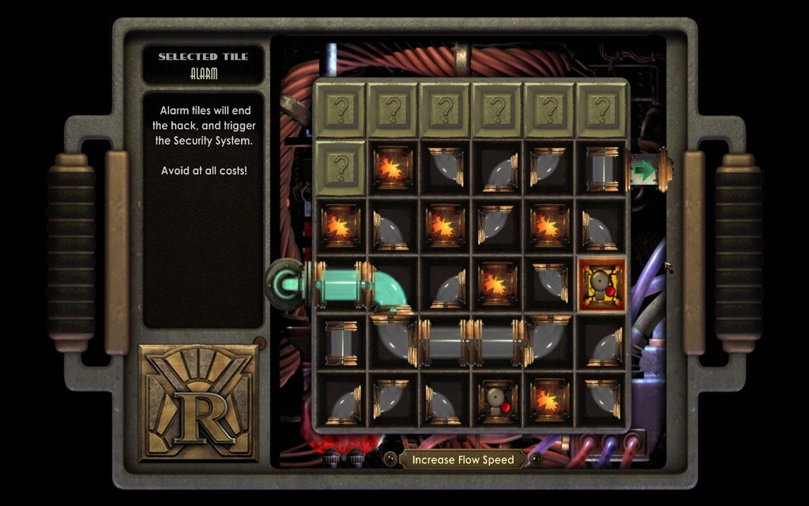
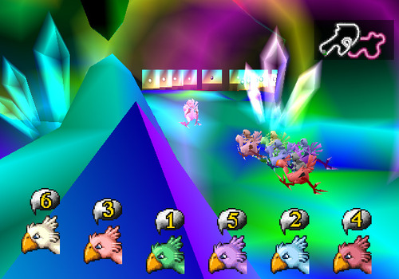
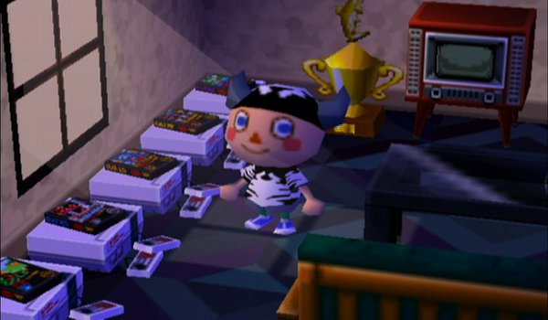
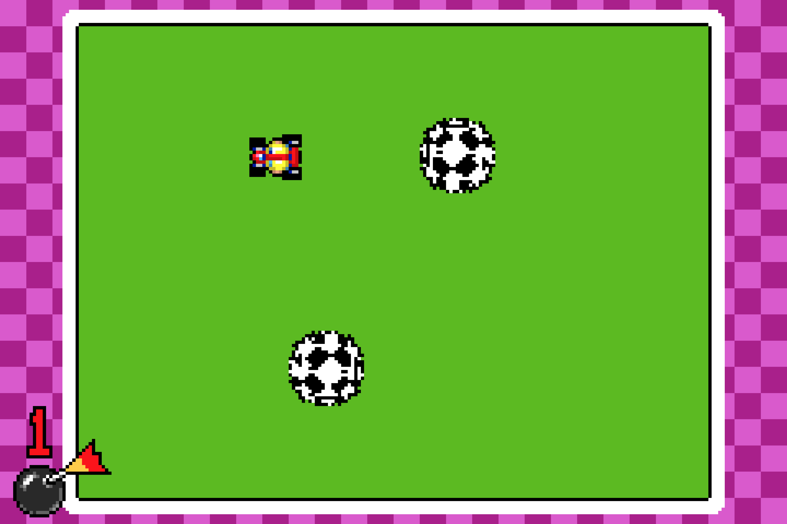

<!--

Collaborate!
 -->

## Microgames

Minigames are small videogames included within larger videogames. They are often included as [Easter eggs](<https://en.wikipedia.org/wiki/Easter_egg_(media)>) or to add variety to the larger game. BioShock—a first-person shooter—used a minigame version of Pipe Dream—a classic puzzler—as the mechanic used to hack doors and machines. Final Fantasy 7 introduced a Chocobo Racing minigame that allowed players to capture, breed, and race large, rideable birds. In Animal Crossing, players can decorate their home with playable NES games.

Some games are made up almost entirely of minigames. Party games like Mario Party, Rayman: Raving Rabbids, and 1-2-Switch allow players to compete in a series of minigame events. Evoland I + II are RPGs that mix many videogame styles and mechanics both by including many minigames and by evolving the presentation of the main game itself.

<!-- commenting this out because now there's a gallery

BioShock Hacking{figure}

Final Fantasy VII Chocobo Racing{figure}

Animal Crossing NES Collection{figure}

 -->

Minigames provide many benefits in game design. They offer a change of pace from the main game, reducing fatigue. They are usually low stakes, reducing stress. A well-placed minigame can improve the pacing of the main game significantly. Offering a break before a spike in the action will increase the apparent contrast in the intensity.

Minigames don't have to carry the weight of a full game. They don't have advance the story or provide the amount of mechanics, levels, and content expected of full games. They are free to focus on a small set of ideas, deliver some fun gameplay, and move on.

The [WarioWare](<https://en.wikipedia.org/wiki/Wario_(franchise)>) series, which debuted in 2003 on the Game Boy Advance, pushed the single-minded focus of minigames as far as possible. WarioWare presents the player with a rapid-fire sequence of microgames that demand only a single action from the player and take just seconds to play. As soon as the player completes one challenge, another begins.

<!-- commenting this out because now there's a gallery

 -->

Designing and building Microgames is a great way to explore game design. Their small scope allows even a single person to conceive, build, and test a game idea in a short amount of time. Each microgame is stripped to its essential element, allowing no distractions to cover up weak central mechanic. When building a microgame is left with a little to worry about as possible beyond the essentials of game design.





## What is a Game?

Many interactive artifacts fall into the categories of _games_, _toys_, or _tools_. What is the difference?

### Class, 10 minutes

Group these interactive artifacts into games, toys, and tools.

Legos, Monopoly, Photoshop, Hammers, Tops, Dolls, Chess, Super Mario Brothers, Pac-man, Telephones{bigger}

Do any of these artifacts belong in more than one category?

Do any of these artifacts belong in other, missing categories?

### Groups, 5 minutes

Brainstorm at least 10 defining or characteristic features of games.

### Groups, 5 minutes

Order your features by importance.

### Class, 10 minutes

Compare group lists.

### Class, 5 minutes

Compare features to each of the artifacts in the list above. Do these features support the way each artifact was grouped?

## p5.play

The p5.play library builds on p5.js to add features commonly needed in interactive applications, especially games. The p5.play homepage describes the library like this:

> p5.play provides a <a href="http://p5play.molleindustria.org/examples/index.html?fileName=sprite.js" target="_blank">Sprite</a> class to manage visual objects in <a href="http://p5play.molleindustria.org/examples/index.html?fileName=sprite4.js" target="_blank">2D space</a> and features such as <a href="http://p5play.molleindustria.org/examples/index.html?fileName=sprite3.js" target="_blank">animation support</a>, <a href="http://p5play.molleindustria.org/examples/index.html?fileName=collisions.js" target="_blank">basic collision detection</a> and <a href="http://p5play.molleindustria.org/examples/index.html?fileName=collisions4.js" target="_blank">resolution</a>, sprite <a href="http://p5play.molleindustria.org/examples/index.html?fileName=sprite8.js" target="_blank">grouping</a>, helpers for mouse and keyboard <a href="http://p5play.molleindustria.org/examples/index.html?fileName=keyPresses.js" target="_blank">interactions</a>, and a <a href="http://p5play.molleindustria.org/examples/index.html?fileName=camera.js" target="_blank">virtual camera</a>. 

> {bigger}

Since p5.play builds on p5.js it should feel pretty familiar. One key difference is that p5.play provides a scene graph. When you create a new sprite, p5.play remembers that it is part of the scene. When you set the velocity of a sprite, p5.play remembers that for you too. When you call `drawSprites()`, p5.play will move and draw all the sprites.

- [p5.play homepage](http://p5play.molleindustria.org/)
- [p5.play examples](http://p5play.molleindustria.org/examples/index.html)
- [p5.play api reference](http://p5play.molleindustria.org/docs/index.html)

**NOTE:** p5.play hasn't been updated in a while, and produces some console errors in newer browsers. The examples seem to work fine still.

## Study Examples

### p5.play Animation

Character art by [Buch](https://opengameart.org/users/buch) @ [opengameart.org](https://opengameart.org/content/a-platformer-in-the-forest)



### p5.play Interaction



## Coding Challenges

Explore p5.play by completing these challenges.

### Modify Example 1{difficulty}

1. Comment out the `addImage` lines. See what happens. Then comment them back.{easy}
1. Change the size parameters on `createSprite`. What happens? Why was this the result?{easy}
1. The Kid in Green is running backwards. Fix that. Tip: `mirrorX` {medium}
1. Make The King run to the right. {medium}
1. Make The King and The Kid in Green run towards each other. Make them stop when they collide. Tip: `overlap()`{hard}
1. Make The King and The Kid in Green “bounce” when they collide. Tip: Look at the “bouncing” p5play example.{hard}

### Modify Example 2

1. Comment out the `mouseActive` line. See what happens. Then comment it back. {easy}
1. Make The King spin when the mouse is over him.{easy}
1. Make The King spin when the mouse is NOT over him.{medium}
1. Make The King spin when he is clicked, and stop when clicked again. {medium}
1. Remove The King from the scene when he is clicked. Start the scene with 10 kings. {hard}
1. Create a microgame from this example! {hard}
   {continue}

## Keep Sketching!

### Sketch

Build interactive experiments that focus on minimally expressing a single mechanic.

### Challenge: Couch Co-op

Cooperative games are games where two or more players work together to achieve a goal. Pandemic, Forbidden Island, and Hanabi are great co-op board games. Portal 2, Lovers in a Dangerous Spacetime, and Towerfall are great co-op videogames.

Couch co-op games are local multiplayer videogames, where two people play together on the same screen—and on the same couch.

Create a couch co-op microgame!

## Reference Links

[Game Maker's Toolkit: What Makes a Good Puzzle?](https://www.youtube.com/watch?v=zsjC6fa_YBg)
: Game Maker's Toolkit is an excellent Youtube series about game design. This video addresses how to design a good micro challenge, and [The Secret Of Mario's Jump](https://www.youtube.com/watch?v=7daTGyVZ60I) analyzes player input.

[Piskel](https://www.piskelapp.com/)
: A tool for building animated sprites.

