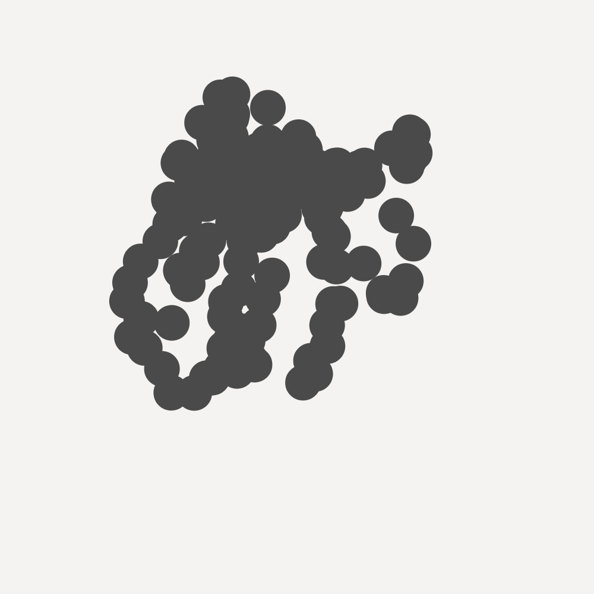
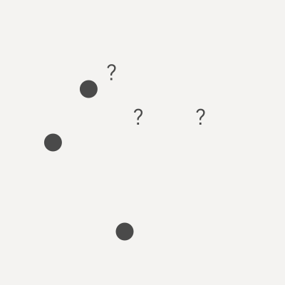
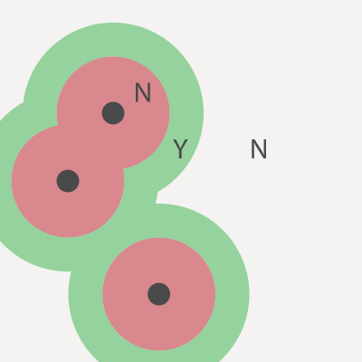
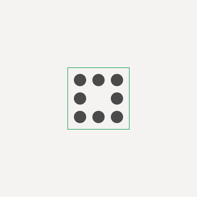
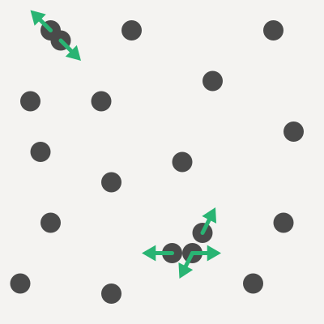
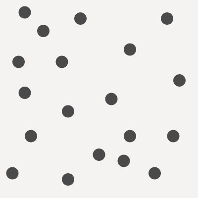
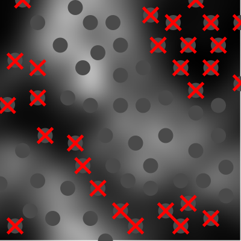
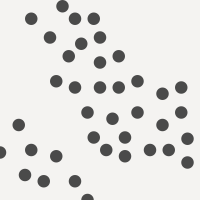

<script src="https://cdn.jsdelivr.net/npm/p5@1.3.1/lib/p5.min.js"></script>

<script src="/mess/strat_mess.js"></script>

## Computational Form + Strategies + Tactics

> “Strategy without tactics is the slowest route to victory. Tactics without strategy is the noise before defeat.”{bigger}

[Probably not Sun Tzu](https://en.wikiquote.org/wiki/Sun_Tzu){attrib}

<style>
canvas {
   image-rendering: pixelated;
}
</style>

So far we've been looking at low-level topics like how to use `random()` and `noise()`. This week we are changing focus to high-level planning. To create more complex systems you must develop a clear understanding of your goal, create a plan to achieve that goal, divide that plan into sub-problems ([decomposition](<https://en.wikipedia.org/wiki/Decomposition_(computer_science)>)) and create code to solve those sub-problems ([implementation](https://en.wikipedia.org/wiki/Implementation)).

When planning and coding a project, I tend to think in terms of _strategies_ and _tactics_.

Strategies
: Strategies are high-level plans for achieving particular goals. Strategies are specific to their goals, and not highly reusable.

_Strategies are composed of tactics._

Tactics
: Tactics are low- to mid-level concrete approaches to solving common problems. Tactics can include specific [algorithms](https://www.khanacademy.org/computing/computer-science/algorithms), [data structures](https://en.wikipedia.org/wiki/List_of_data_structures), [design patterns](https://www.amazon.com/Design-Patterns-Elements-Reusable-Object-Oriented/dp/0201633612), and other reusable components that can be applied to a variety of problems.

_Tactics are composed of smaller tactics and primitives._

Primitives
: Primitives are the programming building blocks provided by your [language](<(https://en.wikipedia.org/wiki/Language_primitive)>) and libraries. These include control structures like loops and functions and built-in data types like variables, objects, and arrays. They may also include more complex tasks like `rect()` and `random()` when the complexity is hidden from your program's frame of reference.

_Primitives are atomic: they are the smallest units of composition and are not further broken down._

<div class="callout">
If you are already familiar with the idea of _design patterns_, my use of the term _tactics_ will sound familiar. I am using _tactics_ to talk of a broader category which includes individual design patterns but also other specific reusable ideas that wouldn't count as design patterns.
</div>

### Building a Toolbox

Becoming familiar with common tactics and being able to recognize the problems they solve is critical to creating more complex code. Tactics are powerful and useful because they are **reusable** and **composable**: the problems they solve appear over and over in a variety of contexts and you can combine tactics in different ways to solve different problems.

_The trick is recognizing the abstract similarities between problems._

For example, compare this code that animates a bouncing ball:



to this code that "bounces" the color of a ball:



These two programs produce different effects, but structurally they are almost identical. The two problems have a similar "shape" and we can use a common tactic to solve them both. We could call this common tactic "bounce". Bounce is fairly simple, but we can break it down further as a composition of smaller common tactics:

Line 20
: A variable increment to provide motion.

_If you want to dig deeper, this is a very simple [explicit numerical integration](https://gafferongames.com/post/integration_basics/) of motion. It is the [Euler method](https://en.wikipedia.org/wiki/Euler_method) simplified by assuming no acceleration and a constant time step._

Line 14 and 17
: A very simple implementation of the [collision detection](https://en.wikipedia.org/wiki/Collision_detection) tactic.

Line 15 and 18
: A very simple implementation of the [collision response](https://en.wikipedia.org/wiki/Collision_response) tactic.

Line 10
: This tactic relies on being run repeatedly in the [game loop](http://gameprogrammingpatterns.com/game-loop.html).

These tactics are all fairly common and they all have names. Some tactics have several names and other tactics don't have names at all. Naming tactics is helpful when communicating with other programmers about your code, but the most important thing is to recognize their essential structures.

Tactics can range from very simple—like using the average of two `random()` calls to center bias the result—to complex—linear congruential generators, noise generation, Brownian motion, L-systems, neural nets, turtles, Markov chains, Poisson-disc sampling, particle systems, fractals, meta-balls. We've seen some of these already and will explore others in the course of this class.

This week we'll look at some tactics for a very common problem in procedural generation: arranging points on a square.

<!--
[[Compostion]]
[[Factoring]]

 to get specific results. As our goals grow **more complex**, we need to approach problems from a much **higher level**. To create more complex systems you must develop a clear understanding of the result you would like to achieve, break the task down into smaller sub-tasks, and then implement the sub-tasks in code. In short you need to have a plan—a strategy—before you start coding.


[[ strategies composed of tactics ]]
[[ In the next section create an explicit bridge saything that "this [points on square] is an example of that [composing strategies of tactics]"


[[ task < tactic < strategy ]]
[[ understanding API Calls + syntax ]]
[[ micro tactics like biasing ]]
[[ bigger tactics like algorithms + data structures]]
[[ design patterns algo + data]]
[[ named things like markov chains and l systems]]

[[methods \ systems : markov chain l system ]]

[[ problem ((randomly generate a musical phrase) ]]
[[ strategy is a high level approach to solving your specific problem]
[[ tactics are a mid or low level approach to solving a small, common sub-problem (animate a value over time, find the highest value in an array)]]
[[ tasks are often provided by api and syntax (draw a square, loop) ]]


[[ design pattern ]]
[[ a template for solving a common problem, usually a software architecture problem, but sometimes applied to other problems ]]
[[ Gang of 4 ]]
[[http://www.gameprogrammingpatterns.com/]]
 -->

<!-- [[above section feels awkwardly positioned, especially after the preceding aside. Maybe this should talk more about "design patterns", composition? -->

<!-- [[I agree. The following discussion section feels awkward too. Knowing that these named strategies are actually tools for solving specific problems is important--I hadn't though of them like that before. But the language in the first paragraph here is pretty vague. Discussing design patterns and composition might clarify it.]]-->

<!--
<div class="callout">
**Tackling Complexity**

When beginner and intermediate programmers run into trouble building more complex projects, they often hear this advice:

> Break your problem into smaller parts, and solve those parts.

[[process vs. structure]]
[[this confuses the process of developing a program with the structure of that program]]
[[a well factored/composed program breaks problems down into sub-problems ]]
[[as a process this is necessary but not sufficient ]]

This advice falls short because it describes how the final program should be structured rather than the process of developing it. It is hard to understand a complex problem and it is hard to break complex problems down into parts. How big should the parts be? How do you build an individual part without the other parts it depends on? Once you have a few working parts, how do you put them together?  With experience, these questions get easier to answer, but advanced programmers still frequently encounter problems they can't initially understand well enough to break down. When this happens to you, you still have an option for getting started: **make a simpler program**.

Imagine you want to make a game like [pong](https://www.youtube.com/watch?v=1LsRGUODHlQ). You could begin by trying to break it down into sub-tasks—keyboard controlled paddles, an animated ball, a scoreboard—but it is hard to plan all those pieces all at once. At the planning stage, you will have a rough idea of how each piece should work. But before you start implementing each piece, you won't know the details. Without understanding the details, the pieces you make probably won't fit together. You might end up with a lot of code that doesn't work and you don't understand. It is much better to have a little bit of code that does work and that you do understand.

Instead, you could start with a very simple program: just draw a little square—the ball—on the screen. Build and run this program to make sure it works. Then start adding on. Make the ball move to the right. Don't worry about the paddles or the score yet: focus on the ball. Make the square bounce when it hits the side. Then make it move diagonally. Make the ball bounce off all the sides. You might make dozens of incremental working programs as you get the basic ball working. As you do, take the time to review the code and make sure you understand how everything works.

Working this way will let you discover the details of how your ball—an important piece of your program—works. These details will help you see how that piece will work with the others. As you start to build other elements—like the paddles or scoreboard—you might find out that you need to go back and change how the ball works. Expect to run into some dead ends, and expect the need to back track. This might have been avoided if you had made a complete plan in the beginning, but _in the beginning, you didn't know enough to make a complete plan_. This reason this strategy works is simple: **instead of trying to do something you can't, you are trying to do something you can.**

</div> -->

<div class="discussion">

## Points on a Square

Consider the image below. How might you make something like this?

{scale}

</div>

## Where Should I Put Things?

Many procedural systems have to answer a fundamental question: _Where should I put things?_

This problem shows up all the time: putting trees on an island, putting beads of water on glass, putting scratches on a spaceship. In these situations, it is important to control the placement carefully to achieve an appropriate look. Trees tend to grow in groups and in certain areas where the conditions are right. They don't tend to grow at high altitudes, in the water, or where there is no rain. Beads of water shouldn't overlap because when beads of water touch, they join into a bigger bead. Scratches are more likely on raised, exposed parts of the ship that might collide with debris. Each situation has different requirements, and depending on your approach, you can determine how planned, chaotic, random, natural, or mechanical the placement feels.

The problems above are all specific instances of the general problem of arranging points. Below we'll look at several tactics for placing and moving points on a square. These tactics can be combined in different ways to generate a wide variety of arrangements. These tactics can help with planting trees, beading water, or banging up a spaceship. They could be adapted to arranging points on lines or in cubes or arranging events in time. You can find applications for these tactics in all areas of procedural generation any time you have things that need to be arranged.





<div class="activity">

## What's the Difference?

Analyze each of the examples below. Carefully consider their similarities and differences.

- How does each example compare to the others?
- What characteristics could be used to group similar examples?
- What applications might each placement pattern have?

Group the examples as you see fit.

{scale}

<p class="boxed download">
    <a href="../handouts/strategy_workshop.ai" download>strategy_workshop.ai</a>
</p>

</div>

## Placement Tactics

### Placing the Points

If we want points arranged on a square, we've got to start by creating some points and assigning them initial positions. There are many, many ways to go about this: here are five relatively simple but powerful tactics.

#### Random Placement

Place each point at a random location on the square.

```javascript
x = random() * width;
y = random() * height;
```

This is a quick, effective, and straightforward way to lay points down. In theory, since the placement is random, all of the points might be placed in a clump or on one half of the square. In practice, the points are mostly evenly distributed over the plane, with some areas a little more or less dense.

{three-up}

#### Grid Placement

Place points on grid squares. One way to do this is a nested loop. This approach guarantees a perfectly even distribution.

```javascript
for (row = 0; row < grid_rows; row++) {
	for (col = 0; col < grid_cols; col++) {
		x = (row + .5) / grid_rows * w;
		y = (col + .5) / grid_cols * h;
        ...
	}
}
```

{three-up}

#### Noise Placement

Place each point at a location determined by a noise lookup.

- Because noise is center-biased, the results will be center-biased.
- Each dot will be placed near the last as the values change in the noise cloud.
- This technique allows you some control over the proximity of successive points.

```javascript
// loop with _i_
x = noise(i * frequency, 0) * w;
y = noise(i * frequency, 1000) * h;
```


{three-up}

#### Proximity Cull Placement

Place points randomly, but reject a point if it is too close to an existing point or too far from all existing points. In the example below, three points already exist and a fourth is being considered. Three possible values are shown. One is too close and one is too far, so they are rejected. The third location is okay, and a fourth point is added at that location.



{three-up}

<div class="links-sidebar">

[Jason Davies:<br/>Poisson-Disc Sampling](https://www.jasondavies.com/poisson-disc/)

</div>

This tactic is essentially unoptimized Poisson-disc sampling. Poisson-disc sampling is great when you need evenly distributed points without pattern artifacts.

#### Stamp Placement

Create predefined arrangements of points by hand or generatively. Copy these arrangements onto different locations.

This technique allows mixing of handmade and procedural design.



{three-up}

### Moving the Points

These tactics can be used to move existing points. Many effects can be created by combining these with the placement tactics above if in different ways.

#### Random Displacement

Given a set of points, offset the location of each point by a random amount. This can be used to roughen up a rigid arrangement like grid placement produces.

```javascript
x = x + random() * width;
y = y + random() * height;
```

{three-up}

#### Noise Displacement

Displace each point by an amount determined by a noise lookup.

- This technique allows for nice control over displacement.
- Can be used to create wave-like effects.

```javascript
x = x + noise(i * frequency, 0) * amount;
y = x + noise(i * frequency, 1000) * amount;
```

{three-up}

#### Relaxation Displacement

Find pairs of points that are near each other. Move them towards or away from each other by a small amount. This technique is often applied several times in a row with small movements, which avoids the problem of pushing a point away from one point, but into another.

- This technique can be used to push points apart to some minimum distance.
- This technique can also be used to pull points together if they are near each other.
- This technique simulates attractive or repulsive forces acting on the points and can be used to loosely simulate natural phenomena.



{three-up}

#### Noise Culling

Sample noise based on the location of the point. Use the sampled value to determine if the point should be culled (discarded).



{three-up}

In the example above, points are removed if the corresponding noise value is too low (dark). This results in patches or islands of dots.

<div class="activity">

## Tactics Match

What tactics might have been used to get each result below?

| Place          | Move       |
| -------------- | ---------- |
| Random         | Random     |
| Noise          | Noise      |
| Grid           | Relaxation |
| Proximity Cull | Noise Cull |
| Stamp          | &nbsp;     |

{scale}

<p class="boxed download">
    <a href="../handouts/strategy_workshop.ai" download>strategy_workshop.ai</a>
</p>

</div>

### Point Placing Demo



<!-- [Point Placing Demo](https://jsbin.com/telipu/edit?js,output) -->

## Study Examples

### Basic Grid Placement



### Basic Random Placement



### Stored Grid Placement



<div class="activity">

## Coding Challenges

Explore the code examples above by completing the following challenges in order. <br/> Don't skip any.

| Time                 | Comment                                                                              |
| -------------------- | ------------------------------------------------------------------------------------ |
| < 11 in 20 Minutes   | You need to put in some extra work to strengthen your understanding of these topics. |
| 11 in 20 Minutes     | Good.                                                                                |
| All 14 in 20 Minutes | Great.                                                                               |

### Modify the Basic Grid Placement Example

1. Change the grid to 10 x 20, 20 x 20, and 100 x 100.
2. Add a little random offset to each circle.
3. Draw a little "pine tree" at each point: a green triangle on a brown square.
4. Remove the `noLoop()`. Does this introduce any problems?

### Modify the Basic Random Placement Example

1. Change the code to place only 10 points. Try placing 1000 points.
2. Use middle biasing when placing points to make them more likely to appear near the center.
3. Draw a little "snowman" at each point: three white circles, stacked.
4. Remove the `noLoop()`. Does this introduce any problems?
   {continue}

### Modify the Stored Grid Placement Example

1. Add a little random offset to each circle.
2. Change the setup to use random placement and place 100 points.
3. This example doesn't need `noLoop()`. Why?
   {continue}

### Challenging Challenges

Continue with the stored random placement code you made above.

1. Draw about 75% of the points as trees and 25% as snowmen.
2. Make sure the points don't switch between trees and snowmen every frame.
3. For each `draw()` move the snowmen a random step left, up, right, or down.
   {continue}

</div>

## Properties of PCG System

When designing a procedural generation system there are several properties to consider. The following properties are borrowed from [PCGBook: Chapter 1](http://pcgbook.com/wp-content/uploads/chapter01.pdf)

### Speed

- How fast does your program need to run?
- Is it okay if it takes a very long time to complete?
- Many times a faster-running program is harder to code and understand.
- A frame of VR content needs to be rendered in under 10ms, and a short pre-rendered animation may take days to render.

### Reliability

- Does your program need to produce a good result every time?
- Are results shown directly to your audience, or will you have the opportunity to edit?

### Controllability

- Does your program expose any user parameters?
- Do you want explore the parameter space manually?
- Do you want to have tight control over the results or should everything work automatically?

### Expressivity and Diversity

- How much apparent range does your system have?
- Does everything look same-y?
- Is it okay for your output to be completely wild or does it need to satisfy some constraints?
- If you are exposing parameters, do they allow for meaningful control?

### Creativity and Believability

- Do you want your results to look natural or hand-made?
- Is it okay for them to look "computer-y"?
- If your system is generating variations on something that already exists, how closely do you want to copy the original?

### Repeatability

- Do you need the ability to generate the same result more than once?

<div class="assignment">

## Challenge + Sketch!

### Base

This is the last week of the "Foundation" unit. Look back at the topics covered so far: tile systems, using random, user parameters, using noise, and now, thinking strategically.

Begin by completing the challenges for this week. Completing this week's challenges will result in two posts. **This week the challenges are required.**

Then keep sketching! For the remaining three posts, I encourage you to build a single, more complex sketch and post work in progress as you go.

### Required Challenge 1: Dots A -> B -> X

- **Analyze** the challenge: clearly describe what the sketch does.
- **Strategize** how you would achieve the same effect.
- **Study** the provided starting code.
- **Recreate** the challenge as closely as you can. You may use the starting code, or start from scratch.
- **Extend** the example to create a unique sketch. Try to make something no one else will.
- **Post** your finished sketch.

`Challenge Goal`



`Challenge Start Code`



### Required Challenge 2: Line A -> B -> X

Same as above: Analyze, Strategize, Study, Recreate, Extend, Post

`Challenge Goal`



<br/>

`Challenge Start Code`



</div>

<div class="assignment">

## Special Assignments

### Read

[Procedural Content Generation in Games](http://pcgbook.com/) is a collection of research in the field of procedural game content. It covers many interesting topics including dungeon+maze generation, fractals, L-systems, generating rules/mechanics, and mixing proc-gen and human-authored content.

[PCG Book, Chapter 1](http://pcgbook.com/wp-content/uploads/chapter01.pdf){boxed right}

### Prepare

Later in this class I will ask you to create special sketches using equipment available to you through The New School. If you haven’t used the following equipment before, you should sign up for orientations. Be ready to use the following equipment by week 8.

- Laser Cutters
- 3D Printers
- Large Format Printers/Plotters
- CNC Mills (optional)

</div>

<!--
<div class="assignment">

## Read + Watch + Play

### Read

[Procedural Content Generation in Games](http://pcgbook.com/) is a collection of research in the field of procedural game content. It covers many interesting topics including dungeon+maze generation, fractals, L-systems, generating rules/mechanics, and mixing proc-gen and human-authored content.

[PCG Book, Chapter 1](http://pcgbook.com/wp-content/uploads/chapter01.pdf){boxed right}

### Watch

[Game Maker's Toolkit](https://www.youtube.com/channel/UCqJ-Xo29CKyLTjn6z2XwYAw) is a Youtube channel that features high-quality video essays on game design.

[GMT: Spelunky](https://www.youtube.com/watch?v=Uqk5Zf0tw3o){boxed right}

### Play

If you want to play Spelunky—optional but highly recommended—original version (not the HD Remake) is free.

[For PC](http://spelunkyworld.com/original.html){boxed right}
[For Mac](https://forums.tigsource.com/index.php?topic=28467.0){boxed right}

</div> -->

## Reference Links

<!--
[Game Maker's Toolkit: How (and Why) Spelunky Makes its Own Levels](https://www.youtube.com/watch?v=Uqk5Zf0tw3o)
: Overview of the Spelunky level generator from a technical and critical perspective.

[Darius Kazemi: Spelunky Mod](http://tinysubversions.com/spelunkyGen/)
: Darius Kazemi has created a mod of the original Spelunky that runs in the browser and visualizes level generation. -->

[bl.ocks.org: Poisson-Disc](https://bl.ocks.org/mbostock/19168c663618b7f07158), [Poisson-Disc II](https://bl.ocks.org/mbostock/dbb02448b0f93e4c82c3)
: Poisson Disc description, visual explanation, and sample code by Mike Bostock.

[Devmag.org: Poisson Disk Sampling](http://devmag.org.za/2009/05/03/poisson-disk-sampling/)
: Longer article on implementing and applying Poisson Disk Sampling

[Random Points on a Sphere](https://www.jasondavies.com/maps/random-points/)
: Nice, interactive demo of three strategies for placing points on a sphere.

[Leena's Inception Overworld Overview](http://bytten-studio.com/devlog/2014/09/08/overworld-overview-part-1/)
: A description of the strategy used to create the main map in Lenna's Inception.

[Game Programming Patterns](http://www.gameprogrammingpatterns.com/)
: An online book that looks at design patterns commonly found in games.
