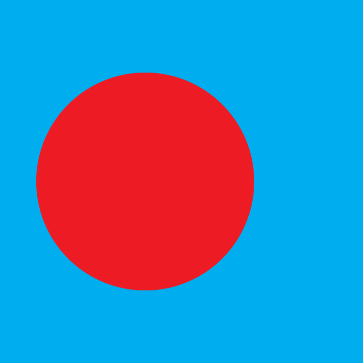
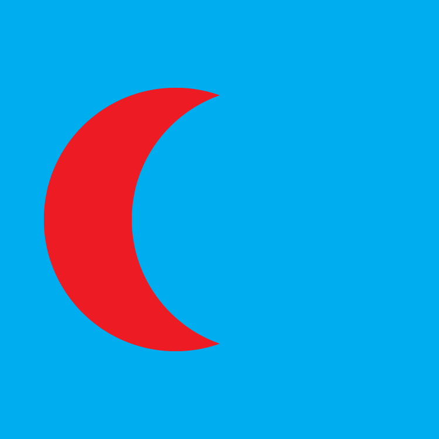

## Vector Data

The Pixel Data chapter discusses working directly with **pixels**, the fundamental, low-level unit of raster graphics. This chapter looks at vector graphics, which represent images as high-level **shapes**. Scalable Vector Graphics, or `svg`, is a common XML-based vector graphics format. SVG files look like this:

```xml
<?xml version="1.0" encoding="UTF-8" ?>
<svg xmlns="http://www.w3.org/2000/svg" viewBox="0 0 360 144">
    <rect fill="#092" y="89.43" width="360" height="54.57"/>
    <rect fill="#0af" width="360" height="90"/>
    <rect fill="#fff" x="252" y="54" width="36" height="36"/>
    <polygon fill="#f00" points="288 54 270 36 252 54 288 54"/>
</svg>
```

<div class="">

<svg xmlns="http://www.w3.org/2000/svg" viewBox="0 0 360 144">
<rect fill="#092" y="89.43" width="360" height="54.57"/>
<rect fill="#0af" width="360" height="90"/>
<rect fill="#fff" x="252" y="54" width="36" height="36"/>
<polygon fill="#f00" points="288 54 270 36 252 54 288 54"/>
</svg>

</div>

SVG files are fairly easy to read and write. One way to get started with vector drawing and code is to write SVG directly by hand and then view them in software like Illustrator or Figma. While this works, SVG is more of an interchange format and isn't really intended for hand coding. In particular, SVG is declarative and doesn't have the imperative control structures—like `if` conditionals and `for` loops—you would may be used to from languages like Javascript.

In this chapter the code examples will use Paper.js, a library for working with vector drawing in Javascript. With Paper.js, you have the full power of Javascript running in a browser and can export SVG files to work with them in other programs.

<!-- [[ recipe vs finished dish? you can go one way, not the other. you can easily remove salt from a recipe, you can't easily remove salt from a dish]] -->





<div class="activity">

## Felt Board

Compare creating scenes using direct mark making vs. cut-out shapes.

### Setup

Divide class into groups. Give some groups felt and scissors and the other group paper and makers.

### Create

_Groups, 5 minutes_

Using only the materials on _your group's_ table, create a side-view depiction of a car.

Before you begin, consider the elements that will make up your image of the car: wheels, doors, windows.

### Share

_Individually, 2 minutes_

Look around the room at what the other groups have made.

### Discussion

_Groups, 5 minutes_

_Class, 5 minutes_

- What are the benefits to creating the scene from felt?
- What are the benefits to creating the scene with paper and markers?
- What are the drawbacks to each?
- What qualities emerge from the two approaches?
- How would you approach animating this scene using the tools you were given?

</div>

### Meaning vs. Form

Vector graphics must be converted to raster graphics—a process called [rasterization](https://magcius.github.io/xplain/article/rast1.html)—in order to be viewed on a pixel-based display. Vector graphics contain all the information necessary to do so, but you can not directly convert _from_ raster images _to_ vector images: In order to do so you would have to make inferences about the meaning implied by the raster image. Form is ambiguous and inferences are just guesses; they may be wrong.

Consider the image below. What would the image look like if the black circle were removed?


<div class="three-up">

We might infer that a red circle lies behind the black one.{scale}

The red shape might be a crescent instead. Or it could be something else entirely. We don't know.{scale}

We don't know if the blue background should continue either.{scale}

</div>

When we look at the image, we quickly infer that it represents two overlapping circles on a blue rectangle, but the raster image doesn't contain information about shapes at all. It contains only blue, red, and black pixels. Humans are very, very good at inferring meaning from visual forms. We fill in meaning without conscious thought. When we look at the image above we see the circles automatically.

<div class="callout">

Humans are so good at inferring visual meaning that it can be difficult for us to separate our inferences from our direct observations. In _Stranger in a Strange Land_ (1961), Robert A. Heinlein explores this idea. One of the book's characters is a _fair witness_, a person who has trained themselves to carefully observe and report what they see without drawing inferences.

> Anne was on the springboard; she turned her head. Jubal called out, "That house on the hilltop—can you see what color they've painted it?"
>
> Anne looked, then answered, "It's white on this side."
>
> Jubal went on to Jill: "You see? It doesn't occur to Anne to infer that the other side is white, too. All the King's horses couldn't force her to commit herself...unless she went there and looked—and even then she wouldn't assume that it stayed white after she left."

</div>

Because we are so good at inferring meaning, meaning is always available to us. Computers are not good at inferring meaning from form. A human can guess that a red circle lies behind the black one, but a computer can't—so the human can imagine the drawing without the circle, and the computer can't.

This is the key advantage of vector graphics over raster graphics: **vector graphics contain high-level _meaning_** about the image that they represent. They are built from semantic units like rectangles and ellipses instead of nonsemantic pixels. This meaning allows computers to easily make high-level changes: we can scale the vector image up and perfectly fill in the needed additional detail; we can change the fonts used to render text; we can remove a shape and reveal what is behind it.

<div class="callout">

Actually, computers _can_ infer meaning from images, they just need to be programmed to do so. This is an extremely active area of research, and the rate of progress in recent years is staggering. This research is already making its way to consumer tools—Photoshop introduced [Content-Aware Fill](https://helpx.adobe.com/photoshop/using/content-aware-fill.html) in 2010. Current approaches are actually **better than humans** at many specific tasks.

The [Two Minute Papers](https://www.youtube.com/channel/UCbfYPyITQ-7l4upoX8nvctg) channel on YouTube summarizes graphics and AI research papers. Here are some great videos:

- [AI Learns Semantic Image Manipulation](https://www.youtube.com/watch?v=XhH2Cc4thJw)
- [Physics-based Image and Video Editing](https://www.youtube.com/watch?v=bVGubOt_jLI)
- [Deep Image Prior](https://www.youtube.com/watch?v=_BPJFFkxSbw)
- [Image Colorization with Deep Learning and Classification](https://www.youtube.com/watch?v=MfaTOXxA8dM)
- [Learning to Fill Holes in Images](https://www.youtube.com/watch?v=psOPu3TldgY)

</div>

## A Hybrid Workflow

Using a vector-based graphics library allows us to computationally generate images, export them in a way that preserves their high-level shape information, and then further manipulate them in vector editing software.

<div class="callout">

Top: Vector Output<br/>Middle: Illustrator » Effect » Stylize » Round Corners...<br/>Bottom: Illustrator » Custom Pattern Brush{scale}

</div>

Building a workflow like this, that combines custom coding with manual manipulation and prebuilt vector effects, can be a powerful approach to exploring form.

## Paper.js

This section introduces [Paper.js](http://paperjs.org/), a Javascript vecotr library developed by [Jürg Lehni](http://lehni.org) and [Jonathan Puckey](http://jonathanpuckey.com).

> Paper.js is an open source vector graphics scripting framework that runs on top of the HTML5 Canvas. It offers a clean Scene Graph / Document Object Model and a lot of powerful functionality to create and work with vector graphics and bezier curves, all neatly wrapped up in a well designed, consistent and clean programming interface.
>
> [About Paper.js](http://paperjs.org/about/){attrib}

You can find an overview of Paper.js [features](http://paperjs.org/features/), a set of [tutorials](http://paperjs.org/tutorials/), and a complete [API Reference](http://paperjs.org/reference/global/) on the Paper.js site.

### PaperScript vs. JavaScript

Paper.js is a JavaScript library, and can be used with JavaScript directly or with a special version of Javascript called PaperScript. Paper.js is easier to use with PaperScript, at least for small projects. You can find info on setting up your workspace here: [Working with Paper.js](http://paperjs.org/tutorials/getting-started/working-with-paper-js/)

You can also use PaperScript with this site's code example editor. You can tell the editor you are using PaperScript with a special comment: `// language paperscript`.

Here is an example of a Paper.js program written in PaperScript:



#### Library Exports

In PaperScript, the library contents are exported to the scope of the program and can be accessed directly. If you use Paper.js with Javascript, you will access the library through the `paper` object.

PaperScript:

```javascript
var path = new Path();
```

Javascript:

```javascript
let path = new paper.Path();
```

#### Operator Overloads

PaperScript lets you use mathematical operators to work with Point and Size objects. You can see this on line 12 in the example above. `circle1Location + new Point(100, 0)` adds two points together by adding their components. `{x: 10, y:10} + {x:5, y:5} = {x: 15, y:15}`. Allowing custom addition procedures for specific types of perators is called _operator overloading_. JavaScript doesn't have operator overloading so you'll have to add each component seperately or use Paper.Point's `add` method.

PaperScript:

```javascript
var point1 = new Point(5, 10);
var point2 = new Point(10, 20);
var result = point1 + point2;
```

Javascript:

```javascript
const point1 = new paper.Point(5, 10);
const point2 = new paper.Point(10, 20);
const result = point1.add(point2);
```

#### `Let` and `Const` Do Not Work in PaperScript

Modern Javascript allows you to declare variables with `let` and `const`. PaperScript is based on an older version of Javascript and supports only `var`.

PaperScript:

```javascript
var point1 = new Point(5, 10);
```

Javascript:

```javascript
let point1 = new paper.Point(5, 10);
```

## Retained Mode vs. Immediate Mode

The p5.js library is an _immediate mode_ graphics library. When you call `rect()` or `ellipse()`, p5.js immediately draws the shape to the canvas.

Paper.js is a _retained mode_ graphics library. When you call `Path.Rectangle()` or `Path.Ellipse()`, Paper.js creates object instances to represent those shapes and adds them to a _scene graph_. The scene graph is editable: you can add, remove, and reorder shapes in the graph and you change their properties. The shapes in the scene graph are all drawn to the canvas at once, when you are done making changes to it.

Creating an animation in p5.js involves constructing and drawing the entire canvas every frame. In contrast, Paper.js redraws the shapes in your scene graph every frame. To create an animation all you have to do is change the properties of your already existing shapes.



Notice that we don't need to create the rectangle or the ellipse in every `onFrame()` call. They are created only once before the animation begins. We also don't need to set the color of the circle every frame. We can set it just when it changes, and that information is also stored in the scene graph.

### SVG Output

Since Paper.js works in retained mode and stores your drawing as a vector scene graph, you can export your scene as an `svg` drawing that you can open in a vector editor like Adobe Illustrator.

The `Project.exportSVG()` function will create an `svg` representation of your project as a string. You need to do a little more work to download this data as a file. You can use the `downloadAsSVG()` in the example below to export your sketches. To export the example click it to focus it, and then press the `s` key to download the export.



## Study Examples

### Basics

This pretty minimal example shows the basics of drawing lines with Paper.js. It shows how to create and configure a path object, and how to add points to the path with `moveTo` and `lineTo`.



### Boolean Operations

A super-useful feature of Paper.js is the ability to combine shapes with boolean operations. This allows you to describe complex shapes by building them from primitives.



<div class="activity challenges">

## Coding Challenges

Explore this chapter's example code by completing the following challenges.{intro}

### Modify the Basic Example

1. Make both lines 8 pixels wide and blue. `•`
1. Set the `.strokeCap` of both lines to `round`. `•`
1. Make 50 lines with random start and end points.<br/>
   You don't have the p5.js `random()` function in Paper.js, but you do have JavaScript's `Math.random()`. This will get you a random value between 0 and 500: `Math.random() * 500`. `••`
1. Make each of the 50 lines a random width and color. `••`

### Modify the Boolean Example

1. Make the green square 500 pixels wide. `•`
1. Change the function that creates comboPath from `subtract` to `unite`. `•`
1. Change the function again. This time try `intersect`. `•`
1. Change the green square to an ellipse. `••`
1. Remove the green and red shapes, leaving only the compound shape. Tip: `.remove()` [docs](http://paperjs.org/reference/path/#remove). `•••`
   {continue}

### Create from Scratch

1. Draw a simple stick figure. `•`
1. Create a compound shape from _three_ shapes using any of the boolean operations: `unite`, `intersect`, `subtract`. Tip: You'll need to do this in two steps. `••`
1. Create the drawing below. `•••`
   {continue}



</div>

## Project Case Study


Paper Garden is a program that generates stylized drawings of plants arranged in a wall garden. It is writen in about 300 lines of PaperScript using [Paper.js](http://paperjs.org/). Read the case study to learn about how this program works and explore the code.

<div class="link-box">

[**Paper Garden** Case Study](./paper_garden/paper_garden.html)

</div>

<div class="assignment">

## Keep Sketching!

### Sketch

Explore using Paper.js. Consider using a hybrid workflow: start with code and Paper.js, export as SVG, and then work manually in vector illustration software.

### Challenge: Laser Cut or Pen Plot

Displaying vector art on a pixel-based display, inkjet printer, or laser printer requires rasterization. It is possible, however, to display vector art without rasterizing using a laser cutter or pen plotter. Explore these tools in combination with creative coding by creating a laser cut or pen plotted design in paper.js.

### Pair Challenge: Vector Swap

1. Create a PaperScript program that outputs vector data.
2. Post an image of the output.
3. Swap your vector data with another person.
4. Manipulate the vector data in a vector tool like Illustrator.
<!-- 5. Post the result. -->

<!-- ### Challenge: Promo Poster{strike}

Create a promotional poster for a real or fictional event. Your poster must be printed in color at 24"x24" or greater. Your poster should promote a specific event (of your choosing) and must include a generative vector element and text describing the title, date, and location of the event.

### Challenge: Lasercut Anything{strike}

Create a lasercut thing. This can be anything you like that combines generative vector data and laser cutting or etching. -->

<!-- **Complete your posts before our next class and bring your posters and laser cuts to class!** -->

</div>

<style>
    .strike {
        text-decoration: line-through;
    }
</style>

## Explore

<div class="link-box">

[**Autodraw** Google](https://www.autodraw.com/)
A Google AI experiment that interprets sketches, using Paper.js for the draw area.

<!-- Currently goes to a gambling site
[Plumin.js](http://www.pluminjs.com/)
: Javascript typeface editing using Paper.js.
-->

[**Variable Fonts** Collection](https://v-fonts.com/)
Experiment with OpenType customizable typefaces.

</div>

<!--
Describe the steps taken to make a drawing
Describe the shapes in the drawing
Describe the results of the steps -->

<!-- Droodles
Roger Price's Droodles were minimal cartoons that played with the ideas of inferred meaning and ambiguity.

One of Prices's Droodles was used as the cover art for Frank Zappa's 1982 album _Ship Arriving Too Late to Save a Drowning Witch_.  -->

<!--
Semantics vs Form vs Syntax

"Colorless green ideas sleep furiously"
Noam Chomsky https://en.wikipedia.org/wiki/Colorless_green_ideas_sleep_furiously -->
<!--


```
for i = 1 to 10
    circle i, 10
```

```
circle 1, 10
circle 2, 10
...
```

```
[0, 0, 0, 255, 0, 0, 0, 255,...]
``` -->
